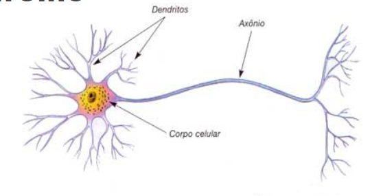
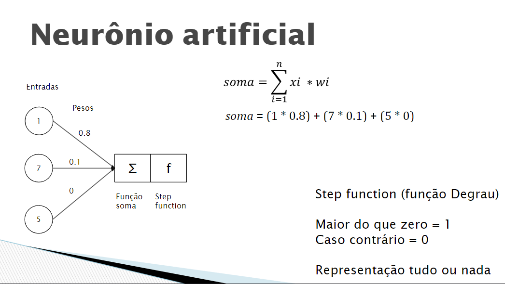
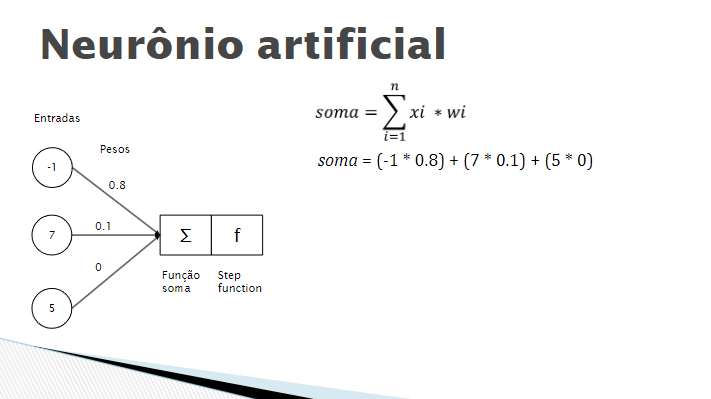
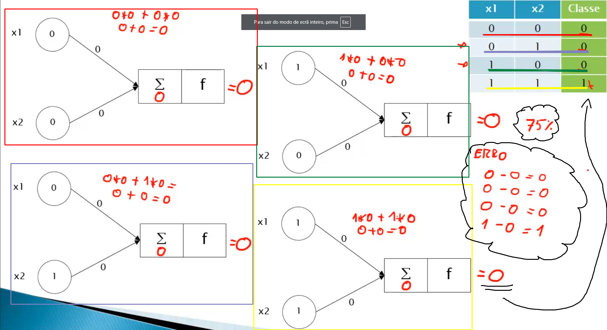

# Curso de Redes Neurais Artificiais - Udemy

Bem-vindo ao repositório para o curso de Redes Neurais Artificiais na Udemy. Este documento serve como uma referência para os temas abordados durante o curso, detalhando o que foi aprendido e como cada conceito é aplicado.

## Sumário

1. [Introdução](#introdução)
2. [Aplicações de Redes Neurais](#aplicações-de-redes-neurais)
3. [Fundamentos Biológicos](#fundamentos-biológicos)
4. [Neurônio Artificial / Perceptron](#neurônio-artificial--perceptron)
5. [Pesos e Sinapses em Redes Neurais](#pesos-e-sinapses-em-redes-neurais)
6. [Treinamento/Ajuste de Peso](#treinamentoajuste-de-peso)
7. [Implementação Passo a Passo de uma Rede Neural com Somente uma Camada](#implementação-passo-a-passo-de-uma-rede-neural-com-somente-uma-camada)
8. [Conclusão](#conclusão)

## Introdução

Este repositório documenta o processo de aprendizado e implementação dos conceitos fundamentais de redes neurais artificiais, com base no curso da Udemy. O objetivo é fornecer uma visão clara e organizada dos tópicos abordados e das técnicas utilizadas.

## Aplicações de Redes Neurais

Neste módulo, exploramos as diversas aplicações das redes neurais artificiais em problemas do mundo real. Algumas das aplicações discutidas incluem:

- **Reconhecimento de Imagem**: Usado em sistemas de visão computacional para identificar objetos e padrões em imagens.
- **Processamento de Linguagem Natural (PLN)**: Aplicado em chatbots, tradução automática e análise de sentimentos.
- **Previsão e Análise de Séries Temporais**: Utilizado para prever dados futuros com base em dados passados.
- **Jogos e Simulações**: Redes neurais são usadas para criar comportamentos de personagens e estratégias em jogos.

## Fundamentos Biológicos

### Neurônio

Os neurônios são as células nervosas responsáveis pela transmissão de informações no sistema nervoso. Eles são a unidade básica do cérebro e do sistema nervoso e desempenham um papel crucial na comunicação entre diferentes partes do corpo e do cérebro. Cada neurônio é composto por três partes principais:

- **Corpo Celular (Soma)**: Contém o núcleo e é responsável pelas funções metabólicas e de manutenção do neurônio.
- **Dendritos**: São extensões ramificadas que recebem sinais de outros neurônios e os transmitem para o corpo celular.
- **Axônio**: É uma extensão longa e fina que transmite sinais elétricos do corpo celular para outros neurônios ou células-alvo.

### Axônio e Comunicação

O axônio é uma estrutura crucial na comunicação neuronal. Ele é responsável por conduzir impulsos elétricos, chamados de potenciais de ação, do corpo celular para outras células. A comunicação entre neurônios ocorre através de sinapses, que são pontos de contato onde o axônio de um neurônio se aproxima de um dendrito ou corpo celular de outro neurônio.

Quando um potencial de ação atinge o final do axônio, neurotransmissores são liberados na sinapse, atravessam a fenda sináptica e se ligam a receptores no neurônio pós-sináptico, transmitindo o sinal. Esse processo é fundamental para o funcionamento do cérebro e para a coordenação das atividades corporais.

  

## Neurônio Artificial / Perceptron

Os neurônios artificiais são a base das redes neurais artificiais, um modelo computacional inspirado no funcionamento dos neurônios biológicos. Um neurônio artificial simula o comportamento de um neurônio biológico em um contexto computacional. Ele é composto pelos seguintes elementos:

- **Entradas (Inputs)**: Dados que são recebidos pelo neurônio artificial. Cada entrada é associada a um peso que determina a importância da entrada para o neurônio.
- **Função de Ativação**: Após as entradas serem ponderadas e somadas, a função de ativação decide se o neurônio deve ser ativado. A função pode ser linear, sigmoidal, ReLU, entre outras (nessa sessão utiliza-se Step Function).
- **Saída (Output)**: O resultado da aplicação da função de ativação é a saída do neurônio, que pode ser passada para outros neurônios na rede.

O objetivo dos neurônios artificiais é aprender a partir dos dados, ajustando os pesos das entradas durante o processo de treinamento para minimizar o erro e melhorar a precisão das previsões ou classificações feitas pela rede neural.

  

O Perceptron é o bloco fundamental das redes neurais e foi abordado com detalhes. Os principais pontos incluem:

- **Estrutura do Perceptron**: Um modelo de neurônio artificial que realiza uma classificação binária.
- **Função de Ativação**: A função que determina a saída do Perceptron com base na soma ponderada das entradas (nessa sessão utiliza-se Step Function).
- **Treinamento do Perceptron**: Processo de ajuste dos pesos para minimizar o erro de classificação.

## Pesos e Sinapses em Redes Neurais

### Sinapses Excitadoras e Inibidoras

No contexto das redes neurais artificiais e do sistema nervoso biológico, as sinapses desempenham um papel crucial na transmissão de sinais entre neurônios. Existem dois tipos principais de sinapses:

- **Sinapse Excitadora**: Quando um neurônio pré-sináptico ativa uma sinapse excitadora, ele aumenta a probabilidade de que o neurônio pós-sináptico gere um potencial de ação. Este tipo de sinapse é associado a pesos positivos em redes neurais artificiais, pois amplifica o sinal de entrada.
  
- **Sinapse Inibidora**: Por outro lado, uma sinapse inibidora reduz a probabilidade de que o neurônio pós-sináptico gere um potencial de ação. Em redes neurais artificiais, isso se reflete em pesos negativos, que diminuem o sinal de entrada.

### Pesos em Redes Neurais

Os pesos são parâmetros fundamentais em redes neurais artificiais e representam a força e a direção da conexão entre neurônios. Aqui estão alguns pontos importantes sobre os pesos:

- **Amplificação e Redução do Sinal**: Pesos positivos amplificam o sinal de entrada, enquanto pesos negativos o reduzem. A magnitude do peso determina a força da influência de uma entrada específica no neurônio de saída.
  
- **Ajuste Durante o Treinamento**: Durante o processo de treinamento, os pesos são ajustados com base no erro da rede para melhorar a precisão das previsões. Esse ajuste é feito através de algoritmos de aprendizado, como o gradiente descendente e a retropropagação.

- **Conhecimento da Rede Neural**: O conhecimento adquirido por uma rede neural é armazenado nos pesos. A configuração dos pesos após o treinamento define como a rede responde a novas entradas e como faz previsões ou classificações.

Em suma, os pesos são essenciais para o funcionamento e a aprendizagem das redes neurais, permitindo que elas se ajustem e aprendam a partir dos dados de treinamento.

  

## Treinamento/Ajuste de Peso

O treinamento de uma rede neural envolve a atualização dos pesos para minimizar a diferença entre as previsões feitas pela rede e as respostas corretas. Este processo é fundamental para que a rede neural aprenda e faça previsões precisas. Abaixo estão os principais conceitos e métodos envolvidos:

### Cálculo do Erro

O erro é a diferença entre a resposta correta e a resposta calculada pela rede neural. O cálculo do erro é essencial para ajustar os pesos e melhorar a precisão da rede. A fórmula para calcular o erro é:

- **Erro = Resposta Correta - Resposta Calculada**

Onde:
- **Resposta Correta** é o valor esperado ou a etiqueta correta para a entrada.
- **Resposta Calculada** é o valor produzido pela rede neural para a mesma entrada.

  

### Algoritmo de Atualização de Pesos

O ajuste dos pesos é realizado iterativamente para reduzir o erro. Um dos algoritmos mais simples para atualizar os pesos é o algoritmo de descida do gradiente. A fórmula para atualizar um peso é:

- **Peso(n + 1) = Peso(n) + (Taxa de Aprendizagem * Entrada * Erro)**

Onde:
- **Peso(n)** é o valor do peso antes da atualização.
- **Taxa de Aprendizagem** é um fator que controla o tamanho do passo dado na atualização dos pesos. Uma taxa de aprendizagem muito alta pode fazer com que a rede se torne instável, enquanto uma taxa muito baixa pode levar a um treinamento lento.
- **Entrada** é o valor da entrada associada ao peso.
- **Erro** é o valor calculado como a diferença entre a resposta correta e a resposta calculada.

## Implementação Passo a Passo de uma Rede Neural com Somente uma Camada

1. **Propagação para Frente**: A entrada é passada pela rede neural, e a resposta é calculada.
2. **Cálculo do Erro**: O erro é calculado com base na resposta correta e na resposta calculada.
3. **Atualização dos Pesos**: Os pesos são ajustados usando a fórmula acima para reduzir o erro.
4. **Repetição**: Esse processo é repetido para múltiplas iterações ou épocas até que o erro seja minimizado e a rede neural esteja suficientemente treinada.

O treinamento continua até que os erros sejam pequenos o suficiente ou até que a rede alcance um número pré-definido de iterações. Esse processo permite que a rede neural aprenda padrões e faça previsões mais precisas.

